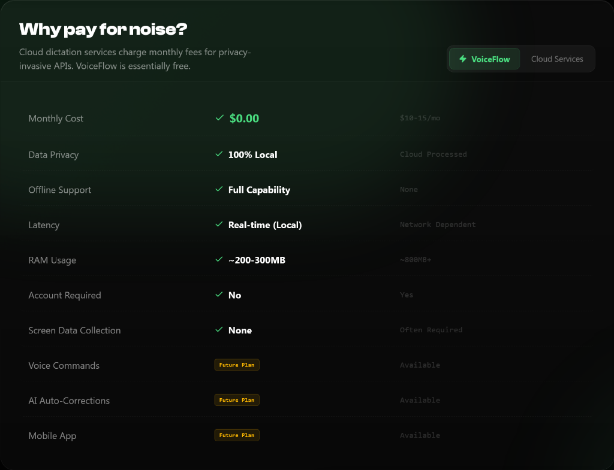
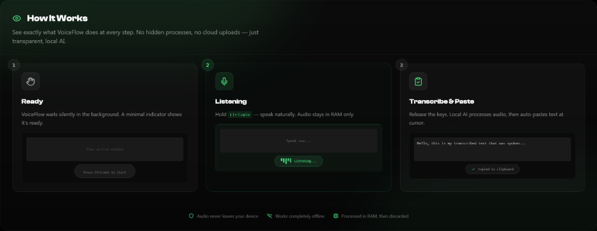
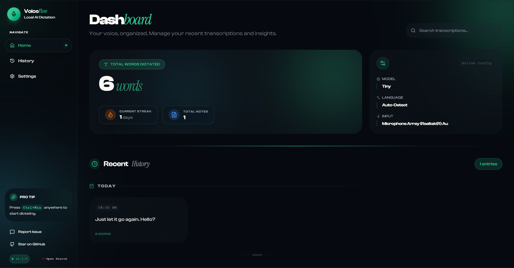
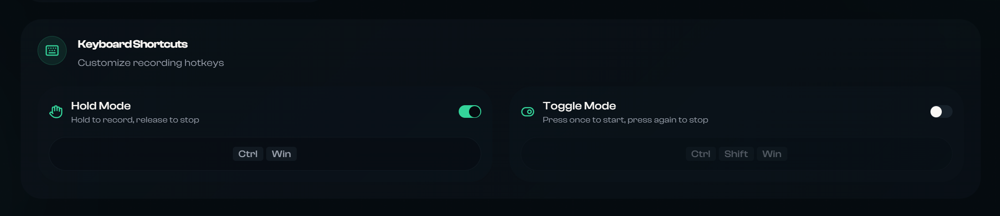
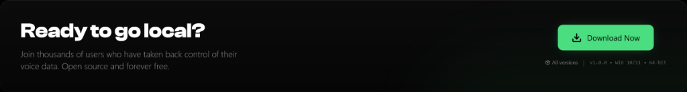

# VoiceFlow

<p align="center">
  
</p>

# Own your Voice.

**Dictate freely with local AI. Zero latency. Zero data leaks. Zero cost.**

VoiceFlow brings OpenAI's Whisper directly to your Windows machine. Every word you speak is processed entirely on your hardware—your voice data never leaves your device. Built for privacy-conscious professionals who demand speed and reliability.

<p align="center">
  <a href="https://github.com/infiniV/VoiceFlow/releases/download/v1.2.1/VoiceFlowSetup-1.2.1.exe">
    
  </a>
  <a href="https://github.com/infiniV/VoiceFlow">
    
  </a>
</p>

---

### Why Pay for Noise?

Cloud dictation services charge monthly fees while harvesting your voice data. VoiceFlow is free, fully local, and yours forever.

<p align="center">
  
</p>

| Feature | VoiceFlow | Cloud Services |
| :--- | :---: | :---: |
| **Cost** | **$0.00** | $10-15/mo |
| **Data Privacy** | **100% Local** | Cloud Processed |
| **Offline Support** | **Full Capability** | None |
| **Latency** | **Real-time** | Network Dependent |
| **Idle Resources** | **<20 MB, 0% CPU** | Varies |
| **Account Required** | **No** | Yes |
| **Open Source** | **MIT License** | Proprietary |

---

### Unbreakable Privacy

Everything runs on localhost. Your microphone data never leaves your RAM. We can't sell your data because we never see it.

*   **Air-Gapped Safe**: Works completely offline after initial model download.
*   **Open Source**: Audit every line of code yourself.
*   **No Telemetry**: Zero tracking, zero analytics, zero cloud calls.

---

### Battery-Friendly Performance

VoiceFlow uses minimal resources when idle so your laptop stays cool and quiet.

*   **Lazy Loading**: AI model loads only when you need it (2-5 second first-use delay).
*   **Auto-Unload**: Model automatically clears from memory after 5 minutes idle (configurable).
*   **~20 MB Idle**: Minimal memory footprint when not in use.
*   **0% CPU**: No background processing or fan noise while idle.

---

### How It Works

No hidden processes, no cloud uploads. Just transparent, local AI at every step.

<p align="center">
  
</p>

#### 1. Ready
VoiceFlow waits silently in your system tray using under 20 MB of memory. The AI model loads only when needed.

#### 2. Listening
Activate with your hotkey and speak naturally. Audio stays in RAM only—the interface visualizes your voice amplitude in real-time.

#### 3. Transcribe & Paste
Release the hotkey. Local AI processes your audio (first use takes 2-5s to load model), then auto-pastes text at your cursor. Model stays loaded for 5 minutes, then auto-unloads to free memory.

<p align="center">
  
</p>

---

### Custom Hotkeys

Configure your preferred keyboard shortcuts with two recording modes to match your workflow.

<p align="center">
  
</p>

*   **Hold Mode**: Hold to record, release to transcribe. Perfect for quick dictation bursts.
*   **Toggle Mode**: Press once to start, press again to stop. Ideal for longer recordings.

---

### Neural Engine

Choose from 16+ Whisper models optimized for different use cases.

#### Model Categories
*   **Standard** (Tiny → Large-v3): From 75MB to 3GB. Balance speed and accuracy for your hardware.
*   **Turbo** (~1.6GB): Best speed-to-quality ratio. Recommended for daily use.
*   **English-only** (.en variants): Optimized specifically for English with improved accuracy.
*   **Distilled**: Faster inference with minimal quality loss.

#### Core Features
*   **99+ Languages**: Automatic language detection built-in.
*   **Custom Hotkeys**: Configure your own shortcuts with Hold or Toggle modes.
*   **Local History**: Searchable SQLite database of all your transcriptions.
*   **Auto-Paste**: Text appears directly at your cursor—no copy-paste needed.
*   **Resource Efficient**: Lazy loading keeps idle usage under 20 MB. Configurable auto-unload timeout (30s to 30 min).

---

### Ready to go local?

Take back control of your voice data. Open source and forever free.

<p align="center">
  <a href="https://github.com/infiniV/VoiceFlow/releases/download/v1.2.1/VoiceFlowSetup-1.2.1.exe">
    
  </a>
</p>

### [Download Installer v1.2.1 (Windows)](https://github.com/infiniV/VoiceFlow/releases/download/v1.2.1/VoiceFlowSetup-1.2.1.exe)

*Windows 10/11 • 64-bit • ~150MB*

<br>
<br>

---

# For Developers

Build and contribute to VoiceFlow.

### Quick Start

```powershell
# Clone and setup
git clone https://github.com/infiniV/VoiceFlow.git
cd VoiceFlow
pnpm run setup

# Development with hot-reload
pnpm run dev

# Build installer
pnpm run build:installer
```

### Architecture

| Layer | Technology |
| :--- | :--- |
| **Core** | Pyloid (PySide6 + QtWebEngine) |
| **Inference** | faster-whisper (CTranslate2) |
| **Frontend** | React 18, Vite, Tailwind CSS v4 |
| **UI** | shadcn/ui, Lucide React |

[Releases](https://github.com/infiniV/VoiceFlow/releases) • [Issues](https://github.com/infiniV/VoiceFlow/issues) • [License](LICENSE)
